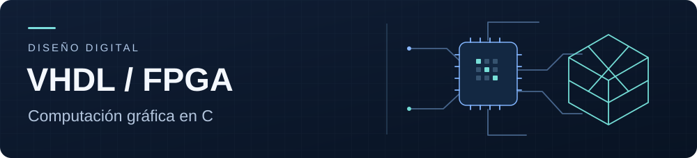
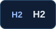
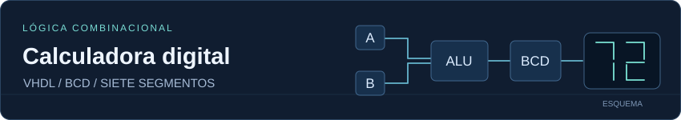
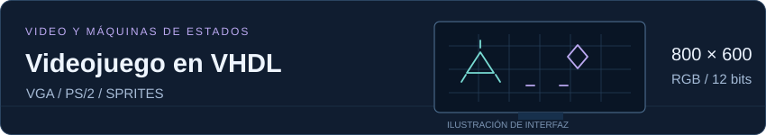

# Thomas Leal Puerta

  <picture>
    <source media="(prefers-reduced-motion: reduce)" srcset="assets/header-static.svg">
    
  </picture>

Mi principal interés es el diseño de sistemas digitales, especialmente la descripción de hardware en VHDL.

  
  
  

## Formación

Estudiante de **Ingeniería Electrónica** e **Ingeniería de Sistemas** en la [Pontificia Universidad Javeriana](https://www.javeriana.edu.co/inicio).

## Tecnologías

### Diseño digital y computación gráfica

  
  
  
  

VHDL para lógica combinacional y secuencial, máquinas de estados y diseño para FPGA. C para geometría tridimensional, trazado de rayos y generación de imágenes.

### Lenguajes

  
  
  
  
  
  
  
  
  
  

### Frameworks y motores

  
  
  
  
  

### Herramientas, datos y pruebas

  
  
  
  

## Proyectos destacados

### Diseño digital

<a href="https://github.com/Tho0x2B/Project1_2530_Disdi">
  <picture>
    <source media="(prefers-reduced-motion: reduce)" srcset="assets/calculator-static.svg">
    
  </picture>
</a>

Circuito combinacional con suma, resta y multiplicación. Incluye conversión a BCD, representación del signo y salida para displays de siete segmentos.

  
  

<a href="https://github.com/Tho0x2B/Project2_2530_Disdi">
  <picture>
    <source media="(prefers-reduced-motion: reduce)" srcset="assets/game-static.svg">
    
  </picture>
</a>

Diseño con generación de video VGA de 800 × 600 píxeles y color RGB de 12 bits. Integra entrada de teclado PS/2, sprites, máquinas de estados, movimiento, disparos y detección de colisiones.

  
  

### Computación gráfica

**[Renderizador 3D en C](https://github.com/Tho0x2B/3DEngine-ThomasLeal)**

Trazado de rayos sobre la CPU para modelos STL binarios. Implementa intersección rayo-triángulo, iluminación difusa y cámara orbital; genera imágenes PPM sin bibliotecas gráficas externas.

  
  

## Actividad en GitHub

  

[Ver actividad en GitHub](https://github.com/Tho0x2B?tab=overview)

## Contacto

[tleal.p@outlook.com](mailto:tleal.p@outlook.com)
